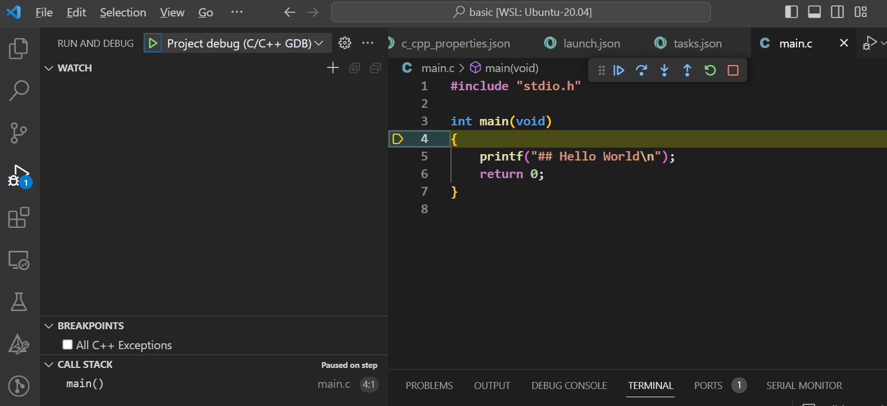

# C 示例工程
> Linux + VSCode + CMake 编译调试C示例工程

在克隆该工程到本地后，可以在各个示例项目下VSCode直接启动调试，终端启动VSCode的命令：`code .`也可以复制示例的工程到指定的目录再编译调试。每个示例工程都各自独立，互不影响。

以Ubuntu 20.04系统为例，需要按照的开发调试环境如下
```sh
sudo apt install cmake build-essential gcc gdb -y
```

## 1.入门使用
### 1.1 克隆工程到本地
```sh
git clone https://github.com/Orionxer/c_project
```
### 1.2 VSCode打开basic工程
```sh
cd basic && code .
```
### 1.3 编译调试
`F7`编译, `F5`启动调试

### 1.4 调试效果


## 2.工程结构说明
如果需要导入其他C文件，则根据以下要求放置文件
- `include`文件夹放置**头文件**，例如：`sha256.h`
- `source`文件夹放置**源文件**，例如：`sha256.c`

根据当前的CMake规则，所有在`include`和`source`文件夹下的文件会自动加入编译链接。

> basic工程Demo已经提供了SHA256库的功能，可以尝试`#include "sha256.h"`计算哈希验证。

## 3.终端编译运行(可选)
```sh
# 工程目录进入build文件夹
## 如果没有build文件夹则创建一个
cd build

# CMake以及make编译
cmake ../ && make

# 运行可执行文件
./main

# 重新编译
## 1.清空build目录
rm -r ./*
## 2.再次编译
cmake ../ && make
```

## 4.其他
关于调试的具体用法，参考该文章: [Linux搭建C开发环境](https://blog.gogo.uno/2024/02/04/vscode-develop-c/)